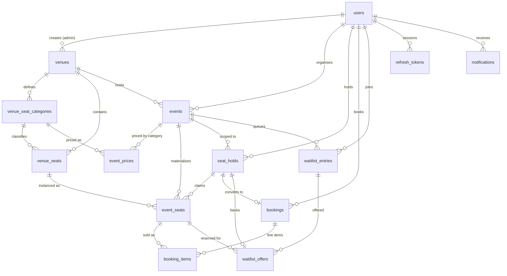

# Database Schema

16 tables (15 domain tables plus `schema_migrations`). The design principle throughout:
**make illegal states unrepresentable in the database**, so an application bug produces a
constraint violation rather than a corrupted booking.

## Entity relationships



`event_seats` sits at the centre: it is the only table that checkout, booking and the
waitlist all contend for.

## Table reference

| Table | Key columns | Constraints and indexes that matter |
| --- | --- | --- |
| **users** | `email` (citext), `password_hash`, `role`, `is_active` | `UNIQUE(email)` on `citext`, so `A@x.com` and `a@x.com` collide. bcrypt cost 12. |
| **refresh_tokens** | `token_hash` (bytea), `expires_at`, `revoked_at`, `replaced_by` | Stores SHA-256, never the token. `replaced_by` gives rotation with reuse detection: presenting a rotated token revokes the whole chain. |
| **venues** | `name`, `address`, `city`, `created_by` | `idx (lower(city))` for the city filter. |
| **venue_seat_categories** | `venue_id`, `name`, `display_order`, `color_hex` | `UNIQUE(venue_id,name)` plus `UNIQUE(venue_id,id)` — the second exists solely as the target of a composite FK from `venue_seats`, which is what stops a seat being given a category from a different venue. |
| **venue_seats** | `row_label`, `seat_number`, `label` (generated), `grid_row`/`grid_col` | `UNIQUE(venue_id,row_label,seat_number)` and `UNIQUE(venue_id,grid_row,grid_col)` — no two seats occupy one cell of the visual grid. `label` is `GENERATED ALWAYS … STORED`, so `A`+`1` is always `A1`. |
| **events** | `organiser_id`, `venue_id`, `type`, `starts_at`, `status`, `hold_ttl_seconds`, `offer_ttl_seconds`, `seat_map_revision` | `CHECK(ends_at > starts_at)`. Partial index on `starts_at WHERE status='PUBLISHED'`. GIN `to_tsvector` index for search. **TTL lives here**, so it is configurable per event with an env default. |
| **event_prices** | PK `(event_id, category_id)`, `price_cents` | Composite PK guarantees exactly one price per category per event. Publishing is blocked until every category the venue uses has a row. |
| **event_seats** ★ | `event_id`, `venue_seat_id`, `category_id`, `price_cents`, `status`, `hold_id`, `hold_expires_at`, `booking_id` | `UNIQUE(event_id, venue_seat_id)` and `chk_seat_state` (below). Partial indexes for availability counts, hold lookup and the expiry sweep. |
| **seat_holds** | `event_id`, `user_id`, `source`, `status`, `expires_at` | `UNIQUE(event_id,user_id) WHERE status='ACTIVE' AND source='CHECKOUT'` — one live checkout hold per user per event. Anti-hoarding: you cannot open ten tabs and lock the house. |
| **bookings** | `reference`, `hold_id`, `status`, `total_cents`, `qr_payload` | `UNIQUE(reference)` and — critically — **`UNIQUE(hold_id)`**. One hold, at most one booking: that *is* the idempotency mechanism. |
| **booking_items** ★ | `booking_id`, `event_seat_id`, `price_cents`, `status` | **`CREATE UNIQUE INDEX … ON booking_items(event_seat_id) WHERE status='ACTIVE'`** — the hard invariant. Price snapshotted per item, so revenue stays historically accurate. |
| **waitlist_entries** | `event_id`, `category_id`, `user_id`, `seats_requested`, `status`, `created_at` | `UNIQUE(event_id,category_id,user_id) WHERE status IN ('ACTIVE','OFFERED')` stops double-joining. Ordering index on `(event_id,category_id,created_at,id) WHERE status='ACTIVE'` makes "who is next" an index scan. |
| **waitlist_offers** | `waitlist_entry_id`, `event_seat_id`, `hold_id`, `token_hash`, `expires_at`, `status` | Two partial unique indexes: one `PENDING` offer per entry, and one `PENDING` offer per **seat** — the database-level proof that two customers can never be offered the same seat. |
| **notifications** | `type`, `payload` jsonb, `status`, `attempts`, `dedupe_key`, `available_at` | Transactional outbox. `UNIQUE(dedupe_key)` prevents a retry sending a second ticket. `available_at` implements exponential backoff with no queue server. |
| **outbox_jobs** | `kind`, `payload` jsonb, `status`, `available_at` | Drained with `FOR UPDATE SKIP LOCKED`. One kind today: `OFFER_WAITLIST_SEATS`. |
| **schema_migrations** | `version`, `name`, `applied_at` | Written by the migration runner. |

## The constraint that carries the design

```sql
CONSTRAINT chk_seat_state CHECK (
     (status = 'AVAILABLE' AND hold_id IS NULL     AND hold_expires_at IS NULL     AND booking_id IS NULL)
  OR (status = 'HELD'      AND hold_id IS NOT NULL AND hold_expires_at IS NOT NULL AND booking_id IS NULL)
  OR (status = 'BOOKED'    AND hold_id IS NULL     AND hold_expires_at IS NULL     AND booking_id IS NOT NULL)
)
```

A seat is exactly one of three things, and each shape pins every other column. Rather
than trusting the service layer to keep `status`, `hold_id` and `booking_id` consistent,
the table asserts it.

## The effective-status view

The most important five lines in the schema:

```sql
CREATE VIEW event_seat_state AS
SELECT es.*,
       CASE
         WHEN es.booking_id IS NOT NULL                         THEN 'BOOKED'
         WHEN es.status = 'HELD' AND es.hold_expires_at > now() THEN 'HELD'
         ELSE                                                        'AVAILABLE'
       END::seat_status AS effective_status
FROM event_seats es;
```

A seat whose hold has expired is logically `AVAILABLE` **immediately**, at the instant
the clock passes `hold_expires_at` — not when the sweeper next runs. Every read goes
through this expression, and every write repeats the same predicate inside its
`FOR UPDATE` transaction. That is why correctness never depends on a background job
having executed.

## Why `event_seats` is separate from `venue_seats`

```
venue_seats                       event_seats
─────────────────────────         ────────────────────────────────────
Physical geometry. Written        Sellable inventory. One row per
once by an admin, then            (event × physical seat), created
essentially immutable.            when the organiser publishes.

  A1  Premium  row A col 1          evt-101 · A1 · Premium  · ₹800 · AVAILABLE
  A2  Premium  row A col 2          evt-101 · A2 · Premium  · ₹800 · HELD (exp 19:42)
  B1  Standard row B col 1          evt-101 · B1 · Standard · ₹400 · BOOKED (bk-7731)
                                    evt-102 · A1 · Premium  · ₹950 · AVAILABLE   ← same
                                    evt-102 · A2 · Premium  · ₹950 · BOOKED      ← physical
                                    evt-102 · B1 · Standard · ₹500 · AVAILABLE   ← seats
```

1. **Independence** — A1 is free at the 18:00 show and sold at 21:00.
2. **Lock granularity** — locking a venue seat would serialise buyers of A1 across
   unrelated shows; locking an event seat confines contention to the people actually
   competing for that seat at that show.
3. **Price is a property of the showing**, not the chair.
4. **Historical accuracy** — `booking_items.price_cents` is a second snapshot, so
   re-pricing never rewrites what a past week earned.

## Booking state machine

```
AVAILABLE ──hold──► HELD ──confirm──► BOOKED
    ▲                 │                  │
    │                 │ TTL passes       │ cancel
    └─────────────────┴──────────────────┘
                                         │
                             cancellation enqueues
                             OFFER_WAITLIST_SEATS
```

## Waitlist entry lifecycle

```
        join (category sold out)
              ▼
           ACTIVE ──seat freed──► OFFERED ──accepts──► FULFILLED
              │                      │
              │ leaves               │ offer TTL passes / declines
              ▼                      ▼
          CANCELLED               EXPIRED  ──► next entrant offered
```
